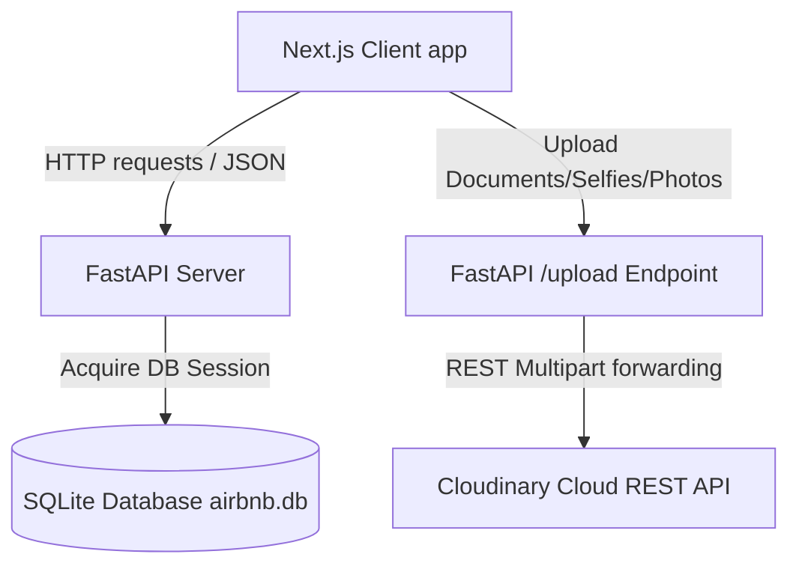
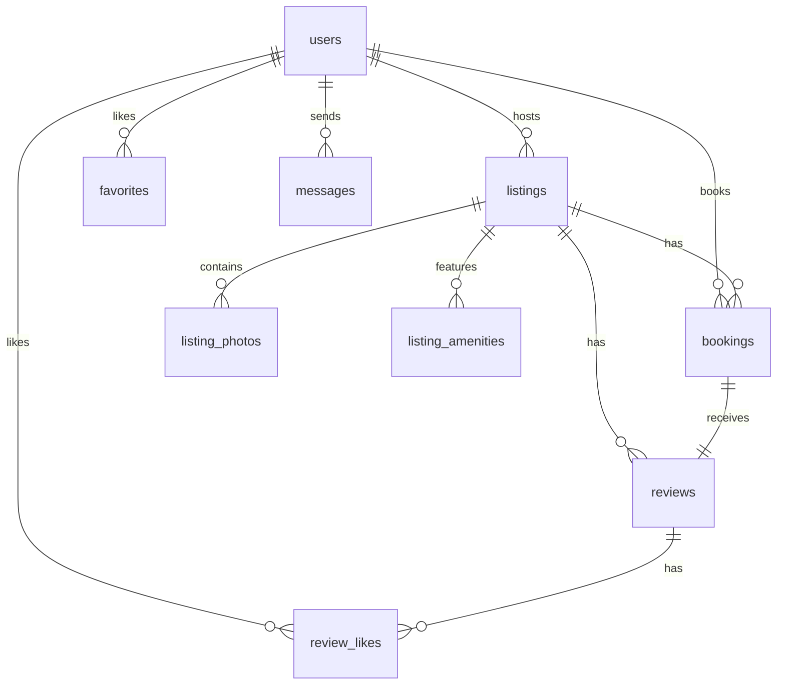

# Airbnb Clone - Antigravity Workspace

A modern, responsive, and feature-rich Airbnb clone built with a **Python/FastAPI** backend and a **Next.js** frontend. It includes listings across 15 destination cities in India, a dual-panel desktop messaging system, a dynamic category selector, and identity verification with secure Cloudinary image uploads.

---

## 1. Project Architecture Overview

This project is structured as a decoupled monorepo containing a Python/FastAPI backend and a React/Next.js frontend.



### Architecture Key Components

1.  **Frontend Client (`/frontend`)**:
    *   Built using **Next.js 16 (App Router)** and styled using custom styling with **Tailwind CSS**.
    *   Utilizes **React Context** to manage Authentication Session and User state.
    *   Dynamic maps are integrated client-side using **Leaflet / React-Leaflet** fetching mapping tiles from OpenStreetMap.
2.  **Backend Services (`/backend`)**:
    *   Built using **FastAPI** to compile endpoints quickly and provide high concurrency.
    *   Database transactions are handled asynchronously via **SQLAlchemy ORM** connecting to a local **SQLite** server database (`airbnb.db`).
    *   Authentication is handled using custom request injectors that extract user credentials from `X-User-Id` request headers (designed for demo logins).
3.  **Upload Pipeline**:
    *   FastAPI proxies local multipart/form-data images to **Cloudinary** REST endpoints using secure upload presets. The frontend handles image selection and renders upload thumbnails locally once secure URLs are returned by the backend.

---

## 2. Database Schema Definition

The SQLite database schema is defined in [entities.py](file:///d:/antigravity/backend/entities.py) and mapped via SQLAlchemy ORM.



### Table Properties

#### `users` (`DBUser`)
*   `id` (Integer, Primary Key)
*   `name` (String, name of user)
*   `email` (String, unique login address)
*   `password_hash` (String, hashed credential representation)
*   `role` (String, defaults to "guest", can be "host")
*   `is_host` (Boolean, indicates hosting privileges)
*   `identity_verified` (Boolean, verified status)

#### `listings` (`DBListing`)
*   `id` (Integer, Primary Key)
*   `host_id` (Integer, ForeignKey pointing to `users.id`)
*   `title` (String, listing title)
*   `description` (Text, stay description)
*   `location_city` (String, city destination)
*   `location_area` (String, area within the city)
*   `price_per_night` (Float, stay cost per night)
*   `property_type` (String, e.g. "Entire home", "Villa")
*   `vibe` (String, category vibe filter like "Beachfront", "Luxury", "Cabins")
*   `max_guests` / `bedrooms` / `beds` / `bathrooms` (Integer fields)

#### `bookings` (`DBBooking`)
*   `id` (Integer, Primary Key)
*   `listing_id` (Integer, ForeignKey pointing to `listings.id`)
*   `guest_id` (Integer, ForeignKey pointing to `users.id`)
*   `check_in` / `check_out` (Date, reservation dates)
*   `guests_count` (Integer, guest party size)
*   `total_price` (Float, overall cost including service/cleaning fees)
*   `refund_amount` (Float, amount refunded upon cancellation)
*   `status` (String, "confirmed" or "cancelled")

#### `reviews` (`DBReview`)
*   `id` (Integer, Primary Key)
*   `listing_id` (Integer, ForeignKey pointing to `listings.id`)
*   `guest_id` (Integer, ForeignKey pointing to `users.id`)
*   `booking_id` (Integer, ForeignKey pointing to `bookings.id`)
*   `rating` (Integer, 1 to 5 stars)
*   `comment` (Text, review description)
*   `host_reply` (Text, host reply comment)

#### Helper Tables
*   `listing_photos`: Contains stay photo URLs (`url`, `sort_order`).
*   `amenities`: Core list of stay features (e.g. WiFi, Pool, Air conditioning).
*   `listing_amenities`: Many-to-many lookup table linking stays to their amenities.
*   `conversations`: Pairs guests and hosts relative to a listing for message threads.
*   `messages`: Logs chat history (`body`, `sender_id`, `read_at`).
*   `favorites` / `review_likes`: Saves bookmarks and like flags for guest reviews.

---

## 3. API Endpoint Overview

All API endpoints receive and return JSON payloads. Authentication is resolved via the custom request header: `X-User-Id: <user_id>`.

### Authentication Endpoints (Prefix: `/auth`)
*   `POST /auth/signup`: Registers a new user account.
*   `POST /auth/login`: Authenticates user login credentials.
*   `GET /auth/me`: Retrieves current session user context.
*   `POST /auth/verify`: Updates the identity verification status of the user.

### Stays Endpoints (Prefix: `/listings`)
*   `GET /listings`: Queries stays (supports vibe, search queries, pagination, pricing, amenities, city, area).
*   `GET /listings/{id}`: Returns stay detail fields (host, photos, reviews, amenities).
*   `POST /listings`: Creates a new listing stay.
*   `PUT /listings/{id}`: Updates a listing stay.
*   `DELETE /listings/{id}`: Removes a listing stay.
*   `GET /listings/{id}/availability`: Returns blocked booking dates (confirmed reservations).

### Booking Endpoints (Prefix: `/bookings`)
*   `POST /bookings`: Books a listing stay (requires check-in, check-out, and guests count).
*   `GET /bookings/my-trips`: Lists bookings made by the active guest.
*   `POST /bookings/{id}/cancel`: Cancels a confirmed booking and calculates eligible refunds.

### Review Endpoints (Prefix: `/reviews`)
*   `POST /reviews`: Leaves a guest review for a completed booking.
*   `GET /reviews/written`: Lists reviews written by the active guest.
*   `PUT /reviews/{id}`: Updates a review comment and rating.
*   `DELETE /reviews/{id}`: Deletes a review.
*   `POST /reviews/{id}/like`: Toggles a like rating on a guest review.
*   `POST /reviews/{id}/reply`: Submits a host reply comment to a review.
*   `DELETE /reviews/{id}/reply`: Deletes a host reply comment.

### Chat Endpoints (Prefix: `/messages`)
*   `GET /messages`: Lists all chat conversations/threads active for the user.
*   `GET /messages/{id}/thread`: Lists message history inside a conversation.
*   `POST /messages/send`: Sends a message to a conversation thread.

### Wishlist Endpoints (Prefix: `/favorites`)
*   `GET /favorites`: Lists all saved listings.
*   `POST /favorites/{id}`: Adds a listing stay to your saved wishlist.
*   `DELETE /favorites/{id}`: Removes a listing stay from your saved wishlist.

### Global Media Endpoint
*   `POST /upload`: Uploads local document, selfie, or listing files directly to Cloudinary and returns a secure HTTPS URL.

---

## 4. Setup and Startup Instructions

### Prerequisites
*   Python 3.10 or higher
*   Node.js 18 or higher (with npm)

### Backend Setup
1. Navigate to the project root directory.
2. Install Python packages:
   ```bash
   pip install -r requirements.txt
   ```
3. Add a `.env` file to the root workspace directory with Cloudinary details:
   ```env
   CLOUDINARY_CLOUD_NAME=djkrmb6d5
   CLOUDINARY_UPLOAD_PRESET=airbnb
   ```
4. Start the FastAPI development backend server:
   ```bash
   python -m uvicorn backend.bootstrap:api_service --reload --host 127.0.0.1 --port 8000
   ```
   *The database `airbnb.db` automatically seeds and initializes on start.*

### Frontend Setup
1. Navigate to the `/frontend` directory:
   ```bash
   cd frontend
   ```
2. Install dependencies:
   ```bash
   npm install
   ```
3. Start the Next.js development server:
   ```bash
   npm run dev
   ```
4. Open [http://localhost:3000](http://localhost:3000) in your web browser.
