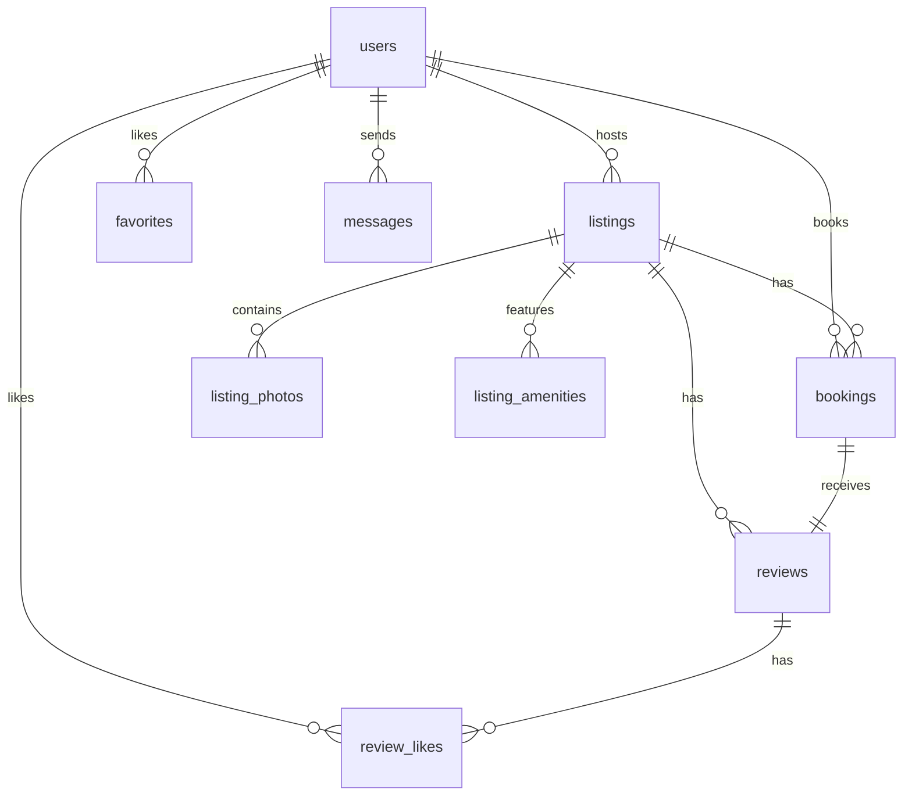

# Airbnb Clone - Antigravity Workspace

A modern, responsive, and feature-rich Airbnb clone built with a **Python/FastAPI** backend and a **Next.js** frontend. It includes listings across 15 destination cities in India, a dual-panel desktop messaging system, a dynamic category selector, and identity verification with secure Cloudinary image uploads.

---

## 1. Project Overview

The workspace is organized into two main folders:
1. **`/server`**: The Python FastAPI backend.
2. **`/frontend`**: The Next.js web application.

---

## 2. Database Schema Definition

The SQLite database (`airbnb.db`) is structured using **SQLAlchemy ORM** (`server/entities.py`). The entity models represent the core relationships of a typical booking marketplace:



### Table Details

#### `users` (`DBUser`)
*   `id` (Integer, Primary Key)
*   `name` (String, name of the user)
*   `email` (String, unique login address)
*   `password_hash` (String, secure password representation)
*   `role` (String, defaults to "guest", can be "host")
*   `is_host` (Boolean, indicates hosting privileges)
*   `identity_verified` (Boolean, identity status)

#### `listings` (`DBListing`)
*   `id` (Integer, Primary Key)
*   `host_id` (Integer, ForeignKey pointing to `users.id`)
*   `title` (String, listing title)
*   `description` (Text, listing details)
*   `location_city` (String, Indian city location)
*   `location_area` (String, area within the city)
*   `price_per_night` (Float, pricing)
*   `property_type` (String, e.g. "Entire home", "Villa")
*   `vibe` (String, categories like "Beachfront", "Cabins", "Trending", "City", "Luxury")
*   `max_guests` / `bedrooms` / `beds` / `bathrooms` (Integer fields)

#### `bookings` (`DBBooking`)
*   `id` (Integer, Primary Key)
*   `listing_id` (Integer, ForeignKey pointing to `listings.id`)
*   `guest_id` (Integer, ForeignKey pointing to `users.id`)
*   `check_in` / `check_out` (Date, trip duration)
*   `guests_count` (Integer)
*   `total_price` (Float, calculated price including fees)
*   `refund_amount` (Float, amount refunded upon cancellation)
*   `status` (String, "confirmed" or "cancelled")

#### `reviews` (`DBReview`)
*   `id` (Integer, Primary Key)
*   `listing_id` (Integer, ForeignKey)
*   `guest_id` (Integer, ForeignKey)
*   `booking_id` (Integer, ForeignKey)
*   `rating` (Integer, 1 to 5 star ratings)
*   `comment` (Text, text content)
*   `host_reply` (Text, host reply comment)

#### Other Tables
*   `listing_photos`: Stores image URLs (`url`, `sort_order`).
*   `amenities`: List of property perks (WiFi, Pool, Air conditioning, etc.).
*   `listing_amenities`: Many-to-many link table connecting listings and amenities.
*   `conversations`: Tracks chat groups between guests and hosts for a listing.
*   `messages`: Individual messages within chat threads (`body`, `sender_id`, `read_at`).
*   `favorites` / `review_likes`: Links user accounts to liked stays or helpful reviews.

---

## 3. How It Works

*   **Database Seeding**: The server checks database columns and records on startup. If missing, it drops all records and seeds a clean collection of **100 Indian properties** split across 15 destination cities, alongside **2 guest accounts** (Rohan, Ananya) and **2 host accounts** (Priya, Aarav) with predefined bookings, messages, and reviews.
*   **Homepage Filtering**: Listings are displayed in a clean grid. You can filter by:
    - Search terms (Destination, dates, guest counts).
    - Vibe category pills at the top (Beachfront, Cabins, Trending, etc.).
    - Filters modal (Price sliders, amenities, property types).
*   **Dual Panel View**: Clicking a search pin or toggling the floating bottom button splits the viewport to display a map on the right side of the screen using Leaflet/OpenStreetMap.
*   **Identity Verification**: Guests must verify their account before booking a listing. The flow captures document and selfie photo selections and uploads them securely via the backend proxy to Cloudinary.
*   **Real-time Chat**: Guests and hosts can message each other. On desktop, the thread screen features a split layout showing the conversation log alongside a listing detail panel.

---

## 4. Setup and Startup Instructions

### Prerequisites
*   Python 3.10 or higher
*   Node.js 18 or higher (with npm)

### Backend Setup
1. Open a terminal and navigate to the project root.
2. Install Python dependencies:
   ```bash
   pip install -r requirements.txt
   ```
3. Set up environment variables inside a `.env` file at the root:
   ```env
   CLOUDINARY_CLOUD_NAME=djkrmb6d5
   CLOUDINARY_UPLOAD_PRESET=airbnb
   ```
4. Start the FastAPI server:
   ```bash
   python -m uvicorn server.bootstrap:api_service --reload --host 127.0.0.1 --port 8000
   ```
   *The database `airbnb.db` will automatically initialize and seed on start.*

### Frontend Setup
1. Open a separate terminal and navigate to the `/frontend` directory:
   ```bash
   cd frontend
   ```
2. Install npm dependencies:
   ```bash
   npm install
   ```
3. Start the Next.js development server:
   ```bash
   npm run dev
   ```
4. Open [http://localhost:3000](http://localhost:3000) in your web browser.
